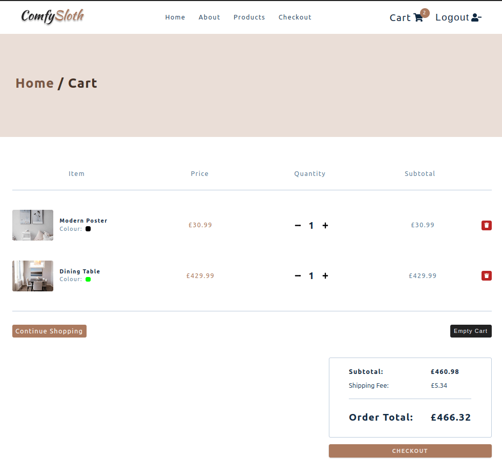

# e-commerce app 
###### author: Michael Shields
###### Visit the deployed site [here](https://mike-shields-e-commerce.netlify.app)

## Intro 

This project is the result of completing a project tutorial from the Udemy course: [React 18 Tutorial and Projects](https://www.udemy.com/course/react-tutorial-and-projects-course/) by [John Smilga](https://github.com/john-smilga).

The tutorial covered how to create an e-commerce application using the following technologies: 

- [React](https://react.dev/) for the front-end user interface.
- [styled-components](https://styled-components.com/) for local styling of UI components.
- [react-icons](https://react-icons.github.io/react-icons/) for icons.
- [Auth0](https://auth0.com/) for user authentication/authorization.
- [Axios](https://axios-http.com/docs/intro) for API requests.
- [Netlify](https://www.netlify.com/) for deployment and serverless functions.
- [Stripe](https://stripe.com/en-gb) for payment support. 

## What I learned

### State Management

This project was my first practical introduction to using React's [useReducer](https://react.dev/reference/react/useReducer) and [context API](https://react.dev/learn/passing-data-deeply-with-context) together, to organise and group application state and business logic into related contexts and actions. 

This pattern abstracted related application state and business logic away from within UI components, making the application's development and file structure easier to navigate and reason about. 

It made the codebase more modular, enabling state and business logic reuse across all of the UI components no matter how nested these components were, reducing the need for prop-drilling.  

### Serverless Functions

This project was also my first introduction to the concept of serverless functions and I learned how they enable small pieces of business logic to be hosted by a service provider, taking away the need to set up a full server environment and handle all the extra concerns that come with along with that such as security and scaling.

### Styled Components

I learned how styled-components along with global CSS, can be used as an alternative way to style UI components. They provide a way to scope CSS styles to specific components and support nested styles similar to SASS, which can eliminate the need to apply class names to every element within a component and eliminate the need for the BEM naming convention.

### Further Development